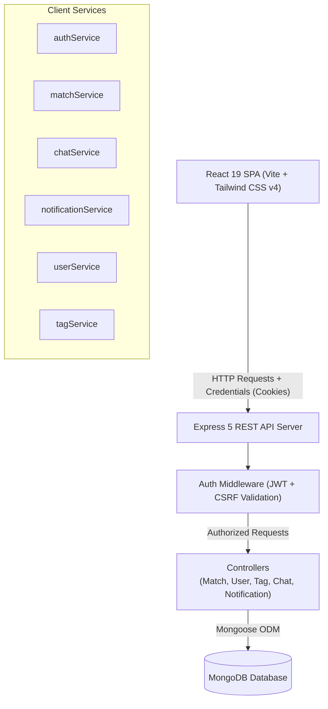

# 🎓 SkillBridge

<p align="center">
  <strong>A Reciprocal Peer-to-Peer Academic Skill Exchange Platform for University Students</strong>
</p>

<p align="center">
  
  
  
  
  
  
</p>

---

## 📌 Table of Contents

- [Overview](#-overview)
- [Key Features](#-key-features)
- [System Architecture](#-system-architecture)
- [Tech Stack](#-tech-stack)
- [Database Models & Taxonomy](#-database-models--taxonomy)
- [2-Cycle Matchmaking Algorithm](#-2-cycle-matchmaking-algorithm)
- [API Reference](#-api-reference)
- [Getting Started](#-getting-started)
  - [Prerequisites](#prerequisites)
  - [Backend Setup](#backend-setup)
  - [Frontend Setup](#frontend-setup)
  - [Database Seeding](#database-seeding)
- [Running Automated Tests](#-running-automated-tests)
- [Project Directory Structure](#-project-directory-structure)
- [Security & Architecture Highlights](#-security--architecture-highlights)
- [Contributing & License](#-contributing--license)

---

## 🌟 Overview

**SkillBridge** is a reciprocal peer-learning platform built specifically for university environments (tailored for Ahsanullah University of Science and Technology - AUST). 

Traditional tutoring systems are often one-sided, costly, or difficult to coordinate. SkillBridge solves this through a **2-cycle bipartite matching algorithm**: instead of simply hiring a tutor, students are paired with peers whose strengths complement each other's learning goals. Student A teaches what they excel at to Student B, and Student B reciprocates with a skill Student A wants to master.

---

## ✨ Key Features

### 1. 🤝 Reciprocal 2-Cycle Matchmaking
- Automatically computes mutual skill overlaps: `UserA.strongTags ∩ UserB.weakTags` and `UserB.strongTags ∩ UserA.weakTags`.
- Ranks candidate peers by match compatibility score, academic semester proximity, and departmental affinity.
- Filters out pending requests, self-matches, and already connected peers.

### 2. 👤 Dynamic Profile & Taxonomy Management
- Clean student profile customization: bio, department, semester, availability, and preferred contact channels.
- Categorized skill tag taxonomy (Languages, Web Dev, Mobile, AI/ML, Data Science, Core CS, Tools).
- Real-time skill management allows adding predefined skills or dynamically resolving/creating new academic tags on the fly.

### 3. 🎯 Discovery Dashboard & Connection Requests
- Live match recommendation feed displaying complementary skill exchange badges ("You Teach" vs "You Learn").
- One-click connection dispatch with instantaneous optimistic UI feedback.
- Quick-access stats card: active connections, topics mastered, and pending requests.

### 4. 🔔 Live Notifications & Decision Center
- Interactive notification tray with unread badge indicators.
- Instant Accept / Decline actions on received peer connection requests.
- Deep-links directly to the peer's private chat upon match acceptance.

### 5. 💬 1-to-1 Peer Messaging
- Modern, clean real-time messaging interface with responsive two-column layout.
- Deep-link support (`/chat?peerId=...` and `/chat?matchId=...`) for instant transition from dashboard, notifications, or history into active conversations.
- Conversation search filter, message status indicators, and smart scroll control.

### 6. 📜 Academic Exchange History
- Comprehensive log of past and ongoing peer exchanges.
- Displays exchange dates, peer profiles, and the exact skills taught vs. learned in each collaboration.

---

## 🏗 System Architecture



---

## 💻 Tech Stack

### Frontend
- **Framework**: [React 19](https://react.dev/)
- **Build Tool**: [Vite 8](https://vitejs.dev/)
- **Routing**: [React Router v7](https://reactrouter.com/)
- **Styling**: [Tailwind CSS v4](https://tailwindcss.com/)
- **State & Context**: React Context API (`AuthContext`) with centralized HTTP client (`apiClient.js`)

### Backend
- **Runtime & Framework**: [Node.js](https://nodejs.org/) & [Express 5](https://expressjs.com/)
- **Database & ODM**: [MongoDB](https://www.mongodb.com/) via [Mongoose 9](https://mongoosejs.com/)
- **Authentication**: Dual-token pattern (Short-lived access JWT + `httpOnly` refresh token cookie)
- **Security**: Double-submit CSRF cookie protection, `bcryptjs` password hashing, `cors` whitelisting

---

## 🗄 Database Models & Taxonomy

The data layer is structured across 5 core Mongoose schemas:

| Model | Collection | Primary Responsibilities |
| :--- | :--- | :--- |
| **`User`** | `users` | Student profile (name, email, password, department, semester, bio, availability) + `strongTags` & `weakTags` (references to `Tag`). |
| **`Tag`** | `tags` | Academic skill taxonomy: unique `name`, `category` (Web Dev, Languages, Core CS, etc.), and text indexing. |
| **`Match`** | `matches` | Connective edge between `userA` and `userB`, mutual `matchedOnTags`, request `status` (`pending`, `accepted`, `declined`), and timestamps. |
| **`Message`** | `messages` | 1-to-1 conversation messages referencing `matchId`, `sender`, `recipient`, text content, and `read` status. |
| **`Notification`** | `notifications` | System alerts dispatched to students on connection requests, accepted matches, and unread activity. |

---

## ⚙️ 2-Cycle Matchmaking Algorithm

The matchmaking engine ([`matchController.js`](server/src/controllers/matchController.js)) computes complementary peer pairings using a multi-factor ranking formula:

```text
Score = (Complementary Teach Overlap * W_teach)
      + (Complementary Learn Overlap * W_learn)
      - (Semester Difference * W_sem)
      + (Same Department Bonus * W_dept)
```

1. **Mutual Skill Verification**:
   - `UserA.strongTags` must intersect with `UserB.weakTags`
   - `UserB.strongTags` must intersect with `UserA.weakTags`
2. **Exclusion Filters**:
   - Ignores existing pending, accepted, or rejected matches involving either party.
   - Prevents duplicate pairings or self-matching.
3. **Adaptive Ranking**:
   - Peers closest in academic year and semester receive higher compatibility ranking to ensure relatable pacing.

---

## 🔌 API Reference

### Authentication (`/api/auth`)
| Method | Endpoint | Description | Protected |
| :--- | :--- | :--- | :---: |
| `GET` | `/api/auth/csrf-token` | Retrieve double-submit CSRF token | No |
| `POST` | `/api/auth/register` | Register a new student account | No |
| `POST` | `/api/auth/login` | Authenticate and obtain JWT + session cookie | No |
| `POST` | `/api/auth/refresh` | Exchange refresh token for fresh access token | Yes (Cookie) |
| `POST` | `/api/auth/logout` | Invalidate refresh cookie and terminate session | Yes |
| `GET` | `/api/auth/me` | Retrieve active student session data | Yes |

### User Profile & Skills (`/api/users`)
| Method | Endpoint | Description | Protected |
| :--- | :--- | :--- | :---: |
| `GET` | `/api/users/profile` | Retrieve profile and populated skill tags | Yes |
| `PUT` | `/api/users/profile` | Update profile information, bio, contact details | Yes |
| `PUT` | `/api/users/skills` | Update strong and weak skill tag arrays | Yes |

### Matchmaking (`/api/matches`)
| Method | Endpoint | Description | Protected |
| :--- | :--- | :--- | :---: |
| `GET` | `/api/matches/suggestions` | Retrieve ranked complementary peer suggestions | Yes |
| `POST` | `/api/matches/request` | Send a connection request to a candidate peer | Yes |
| `POST` | `/api/matches/:id/accept` | Accept an incoming match request | Yes |
| `POST` | `/api/matches/:id/decline`| Decline an incoming match request | Yes |
| `GET` | `/api/matches/history` | Retrieve completed and active match history | Yes |

### Real-Time Chat (`/api/messages`)
| Method | Endpoint | Description | Protected |
| :--- | :--- | :--- | :---: |
| `GET` | `/api/messages/conversations` | Retrieve all active conversations & unread counters | Yes |
| `GET` | `/api/messages/:matchId` | Fetch message history for a match | Yes |
| `POST` | `/api/messages/:matchId` | Send a new chat message to peer | Yes |

### Notifications & Tags (`/api/notifications`, `/api/tags`)
| Method | Endpoint | Description | Protected |
| :--- | :--- | :--- | :---: |
| `GET` | `/api/notifications` | Fetch recent notifications with relative timestamps | Yes |
| `PUT` | `/api/notifications/read-all`| Mark all notifications as read | Yes |
| `PUT` | `/api/notifications/:id/read`| Mark a single notification as read | Yes |
| `GET` | `/api/tags` | List all available skill taxonomy tags | Yes |
| `GET` | `/api/tags/categories` | Retrieve distinct skill categories | Yes |

---

## 🚀 Getting Started

### Prerequisites
- [Node.js](https://nodejs.org/) (v18.0.0 or higher recommended)
- [npm](https://www.npmjs.com/) (v9.0.0 or higher)
- [MongoDB](https://www.mongodb.com/) running locally on port `27017` (or a MongoDB Atlas connection string)

---

### Backend Setup

1. Open a terminal and navigate to the `server` directory:
   ```bash
   cd server
   ```

2. Install backend dependencies:
   ```bash
   npm install
   ```

3. Create a `.env` file in the `server` root (you can copy `.env.example`):
   ```env
   PORT=5000
   NODE_ENV=development
   MONGODB_URI=mongodb://localhost:27017/skillbridge
   JWT_SECRET=your_jwt_access_secret_key_here
   JWT_REFRESH_SECRET=your_jwt_refresh_secret_key_here
   COOKIE_SAMESITE=lax
   CLIENT_URL=http://localhost:5173
   ```

4. Start the backend development server:
   ```bash
   npm run dev
   ```
   The backend will start listening at `http://localhost:5000`.

---

### Frontend Setup

1. Open a new terminal and navigate to the `client` directory:
   ```bash
   cd client
   ```

2. Install frontend dependencies:
   ```bash
   npm install
   ```

3. Start the Vite development server:
   ```bash
   npm run dev
   ```
   The application will be accessible at `http://localhost:5173`.

---

### Database Seeding

To quickly populate the database with standard academic taxonomy categories (Languages, Core CS, Web, Mobile, AI/ML) and test student accounts with pre-configured strong/weak skills:

```bash
cd server
npm run seed
```

---

## 🧪 Running Automated Tests

SkillBridge includes dedicated test suites for unit logic, security tokens, and the matchmaking engine:

```bash
cd server
npm test
```

This runs:
- `test/unitTest.js`: Validates password hashing, JWT signing/verification, and cookie formatting.
- `test/matchingAlgorithmTest.js`: Validates 2-cycle reciprocal pairing, edge cases, department weightings, and exclusion filters.

---

## 📂 Project Directory Structure

```text
skillbridge/
├── client/                     # Frontend React 19 Application
│   ├── public/                 # Static assets & favicons
│   ├── src/
│   │   ├── assets/             # Brand logos & graphics
│   │   ├── components/         # Reusable UI components (Navbar, BottomNav, TagBadge)
│   │   ├── context/            # AuthContext (state, tokens, session initialization)
│   │   ├── pages/              # Primary route views:
│   │   │   ├── LandingPage.jsx # Hero showcase and platform overview
│   │   │   ├── Login.jsx       # Student authentication
│   │   │   ├── Register.jsx    # Registration & onboarding
│   │   │   ├── Dashboard.jsx   # Match recommendations & skill management
│   │   │   ├── Profile.jsx     # Full profile editor & skill taxonomy manager
│   │   │   ├── Chat.jsx        # 1-to-1 conversation window & peer selector
│   │   │   ├── Notifications.jsx # Incoming request manager & alerts
│   │   │   └── History.jsx     # Completed & active exchange archive
│   │   ├── services/           # Axios-like custom API client & resource services
│   │   ├── App.jsx             # Route switch (Public, Protected, Guest-only)
│   │   ├── index.css           # Tailwind CSS imports & global theme variables
│   │   └── main.jsx            # React root mount
│   ├── package.json
│   └── vite.config.js
│
├── server/                     # Backend Node.js / Express API
│   ├── src/
│   │   ├── config/             # Database connection & cookie security options
│   │   ├── controllers/        # Route controllers (match, user, tag, chat, notification, auth)
│   │   ├── middleware/         # Auth verification, CSRF, and input validation
│   │   ├── models/             # Mongoose schemas (User, Tag, Match, Message, Notification)
│   │   ├── routes/             # Express route declarations
│   │   ├── utils/              # Seeder, JWT generators, and cookie helpers
│   │   ├── app.js              # Express app initialization & middleware stack
│   │   └── index.js            # Server entry point & DB bootstrap
│   ├── test/                   # Unit & matchmaking algorithm test suites
│   ├── package.json
│   └── .env.example
│
└── README.md                   # Project documentation
```

---

## 🔒 Security & Architecture Highlights

- **Dual-Token Authentication**: Access tokens expire in 15 minutes, while refresh tokens are securely persisted in `httpOnly`, `SameSite=Lax` cookies to prevent XSS credential theft.
- **CSRF Protection**: All state-modifying requests (`POST`, `PUT`, `DELETE`) require a matching CSRF token header via the double-submit cookie pattern.
- **Zero Raw Passwords**: Passwords are salted and hashed using `bcryptjs` with an adaptive workload cost factor.
- **Defensive Error Handling**: Safe null checks across populated relations prevent server termination if a matched peer account is deleted.
- **Deep-Link URL Resolvers**: Supports direct state navigation across history, notifications, and chat via sanitized URL query parameters (`/chat?peerId=...`).

---

## 🤝 Contributing & License

Contributions, feature suggestions, and improvements are welcome!

1. Fork the repository
2. Create your feature branch (`git checkout -b feature/AmazingFeature`)
3. Commit your changes (`git commit -m 'Add some AmazingFeature'`)
4. Push to the branch (`git push origin feature/AmazingFeature`)
5. Open a Pull Request

Distributed under the **ISC License**. Developed with ❤️ for university peer learning.
