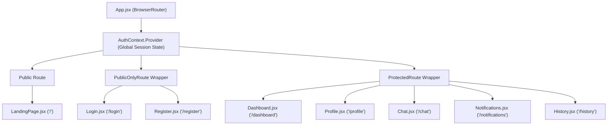
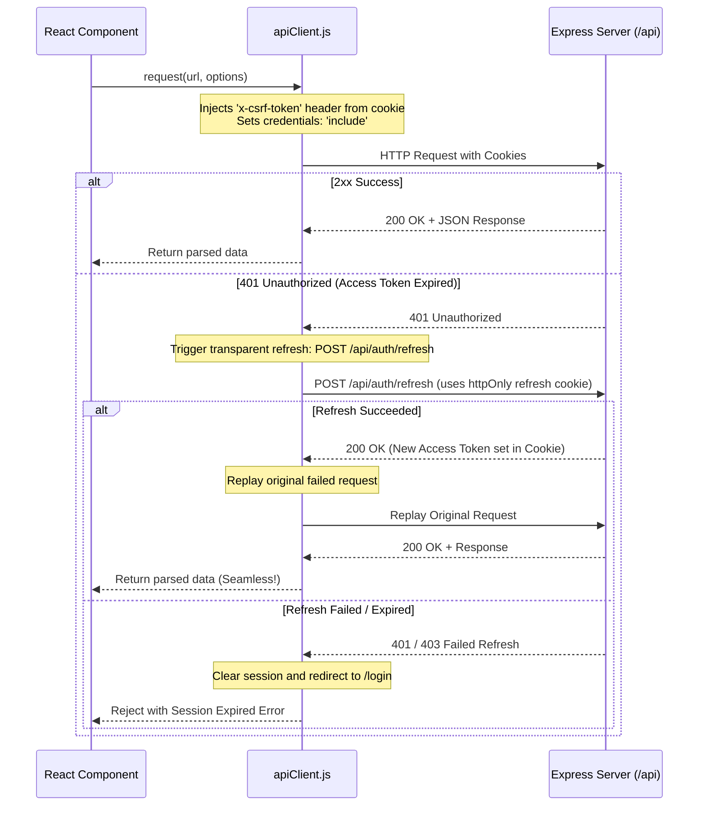

# 🎨 SkillBridge Frontend Architecture & Viva Voce Guide

This document provides a comprehensive, production-grade architectural breakdown of the **SkillBridge** client application (React 19, Vite, Tailwind CSS v4). It explains component topology, authentication lifecycle, HTTP interceptors, routing guards, deep-linking patterns, and includes an exhaustive Viva Voce defense preparation guide.

---

## 1. Directory Structure & File Map

```text
client/
├── public/                     # Static public assets (favicons, manifest)
├── src/
│   ├── assets/                 # SVGs, brand illustrations, icons
│   ├── components/             # Modular, reusable presentation components
│   │   ├── Navbar.jsx          # Top application navigation bar with live unread counter
│   │   ├── BottomNav.jsx       # Mobile bottom navigation bar for handheld viewports
│   │   └── TagBadge.jsx        # Categorized visual badge for skill taxonomy
│   ├── context/
│   │   └── AuthContext.jsx     # Global authentication state, session bootstrapping, guards
│   ├── pages/                  # Primary page views (routed via React Router v7)
│   │   ├── LandingPage.jsx     # Public hero presentation and feature marketing
│   │   ├── Login.jsx           # Student login screen with credentials validation
│   │   ├── Register.jsx        # Registration screen with academic onboarding fields
│   │   ├── Dashboard.jsx       # Real-time peer match discovery & quick skill editor
│   │   ├── Profile.jsx         # Full student profile & skill taxonomy management
│   │   ├── Chat.jsx            # 1-to-1 peer conversation view with URL deep-linking
│   │   ├── Notifications.jsx   # In-app notifications & match request action center
│   │   └── History.jsx         # Past and active academic exchange archive
│   ├── services/               # Centralized API network layer
│   │   ├── apiClient.js        # Configured fetch wrapper with CSRF injection & 401 interceptor
│   │   ├── authService.js      # Auth endpoints (login, register, refresh, logout, csrf)
│   │   ├── matchService.js     # Match endpoints (suggestions, request, accept, decline, history)
│   │   ├── userService.js      # User profile retrieval and skill update endpoints
│   │   ├── chatService.js      # Conversation listing and message retrieval/sending
│   │   ├── notificationService.js # Notification feed and read status mutation
│   │   └── tagService.js       # Taxonomy listing, categories, and custom tag creation
│   ├── App.jsx                 # Routing declaration (Public, Protected, Guest-only)
│   ├── App.css                 # Application-wide supplementary animations
│   ├── index.css               # Tailwind CSS v4 imports and theme variables
│   └── main.jsx                # React 19 application mount point
├── package.json                # Frontend dependencies & npm scripts
├── vite.config.js              # Vite bundler configuration & React plugin
└── FRONTEND_ARCHITECTURE.md    # Frontend system documentation
```

---

## 2. Component Hierarchy & Routing Architecture

SkillBridge uses **React Router v7** with strict route authorization wrappers declared in `App.jsx`:



### Route Guard Implementations (`AuthContext.jsx`)
1. **`ProtectedRoute`**:
   - Checks `isAuthenticated` and `loading` status.
   - If loading, displays a branded pulsing spinner to prevent screen flicker.
   - If unauthenticated, performs a `<Navigate to="/login" replace state={{ from: location }} />` redirection.
2. **`PublicOnlyRoute`**:
   - Ensures authenticated users accessing `/login` or `/register` are immediately redirected to `/dashboard`.
   - Prevents duplicate logins or auth state confusion.

---

## 3. Network Architecture & Security Pipeline (`apiClient.js`)

All outbound network requests flow through a unified HTTP client that handles credentials, automatic CSRF injection, and transparent token refreshing.



### Core Security Highlights in Client
- **Double-Submit CSRF Cookie Pattern**: On initial load, `authService.getCsrfToken()` requests a cryptographic token from `/api/auth/csrf-token`. This token is stored in a cookie (`_csrf`) and read by `apiClient.js` to populate the `x-csrf-token` HTTP header on all non-GET requests (`POST`, `PUT`, `DELETE`).
- **HttpOnly Refresh Cookie**: The refresh token is never exposed to JavaScript variables or `localStorage`. It cannot be intercepted by XSS attacks.
- **Silent Re-Authentication**: Expired 15-minute access tokens trigger an automatic token rotation without interrupting the user's active workflow or chat session.

---

## 4. Key Page Logic & Deep-Linking Design

### 1. Dashboard (`Dashboard.jsx`)
- Fetches real-time suggestions via `matchService.getMatchSuggestions()`.
- Renders peer cards with reciprocal skill badges:
  - **Teal Badges**: Skills the candidate can teach the current user.
  - **Indigo Badges**: Skills the current user will teach the candidate.
- Quick skill management drawer allows adding and removing skills directly without leaving the dashboard.

### 2. Live Notifications (`Notifications.jsx`)
- Polling / real-time updates for connection requests.
- Implements optimistic UI updates: clicking "Accept" immediately marks the item accepted and sends `POST /api/matches/:id/accept`.
- **Deep Linking**: Once accepted, clicking the message action routes directly to `/chat?peerId=${n.senderId}`, automatically opening the active conversation in `Chat.jsx`.

### 3. Real-Time Chat (`Chat.jsx`)
- Dual-column responsive layout:
  - Left panel: Searchable active conversations list with unread counter badges.
  - Right panel: Active chat window with message history, smart scroll lock, and text composer.
- **Query Parameter Resolution**:
  - Automatically parses `searchParams.get("peerId")` or `searchParams.get("matchId")`.
  - Automatically locates or initiates the conversation matching that peer, providing seamless transition from any other page in the application.
- **Smart Scroll Management**:
  - Auto-scrolls to the newest message when sending or upon first loading a thread.
  - Allows natural user scrolling through older messages without jarring auto-scroll jumps.

### 4. Student Profile (`Profile.jsx`)
- Complete state management for academic identity: Full Name, Department (CSE, EEE, ME, etc.), Semester (1–8), Bio, Availability slots.
- Dual-section skill taxonomy manager:
  - **Can Teach (Strengths)**: Skills offered to peers.
  - **Want to Learn (Learning Goals)**: Skills sought from peers.
- Auto-resolves tag names against existing categories or creates dynamic tags server-side.

---

## 5. Styling Architecture & Design Tokens (Tailwind CSS v4)

SkillBridge leverages **Tailwind CSS v4** utilizing modern CSS variables and utility classes:

| Token / Category | Tailwind Utility Values | Design Purpose |
| :--- | :--- | :--- |
| **Primary Brand** | `indigo-600`, `indigo-700`, `indigo-50` | Academic trust, focus, and primary CTA buttons |
| **Reciprocal Learn** | `teal-600`, `teal-700`, `teal-50` | Visual differentiator for skills learned from peers |
| **Neutral Canvas** | `slate-50`, `slate-100`, `slate-900` | High-contrast clean typography and card surfaces |
| **Alert & State** | `amber-500` (pending), `emerald-500` (online/accepted), `rose-500` (decline) | State communication across badges and indicators |
| **Surfaces & Glass** | `backdrop-blur-md`, `bg-white/80`, `shadow-xs`, `rounded-2xl` | Modern glassmorphic floating cards and headers |

---

## 6. Viva Voce & Project Defense Q&A

### Architecture & Framework
**Q1: Why did you choose React 19 and Vite instead of Next.js or Create React App?**
> *Answer*: SkillBridge is designed as a dynamic, client-heavy single-page application (SPA) where students interact through real-time chat, instant notifications, and interactive matching filters. Vite provides ultra-fast Hot Module Replacement (HMR) and optimized Rollup bundling without the overhead of server-side rendering (SSR), which is unnecessary for an authenticated intranet portal. Create React App is officially deprecated.

**Q2: What is the role of `AuthContext.jsx` in the frontend lifecycle?**
> *Answer*: `AuthContext` provides a unified state container wrapping the application tree. It maintains `user`, `isAuthenticated`, and `loading` states. When the app boots, it invokes `authService.getMe()`. If valid cookies exist, the session is restored instantly; otherwise, the user is transitioned to public routes without page reloads.

**Q3: How do `ProtectedRoute` and `PublicOnlyRoute` work internally?**
> *Answer*: Both are higher-order wrapper components using React Router's `<Outlet />` and `<Navigate />`. `ProtectedRoute` checks if `isAuthenticated` is true; if false, it redirects to `/login` while saving `location` in history state for post-login return. `PublicOnlyRoute` ensures logged-in students cannot visit login or register pages, redirecting them to `/dashboard`.

---

### Security & Networking
**Q4: How does SkillBridge protect against Cross-Site Request Forgery (CSRF)?**
> *Answer*: We employ the double-submit CSRF pattern. On boot, the client requests a CSRF token from the server, which sets a readable `_csrf` cookie. On all mutating requests (`POST`, `PUT`, `DELETE`), `apiClient.js` extracts this value and attaches it to the `x-csrf-token` header. Since an attacker site cannot read cookies across origins under Same-Origin Policy, malicious forged requests will lack this header and be rejected with HTTP 403.

**Q5: Why are tokens not stored in `localStorage`?**
> *Answer*: `localStorage` is vulnerable to Cross-Site Scripting (XSS). If any third-party script or dependency is compromised, tokens in `localStorage` can be extracted. Storing the refresh token in an `httpOnly`, `SameSite=Lax` cookie prevents JavaScript from ever reading it, neutralizing token theft via XSS.

**Q6: What happens when the 15-minute access token expires while a user is typing a message?**
> *Answer*: The request receives an HTTP 401 from the backend. The custom interceptor in `apiClient.js` intercepts this error, halts the request, calls `authService.refreshToken()` (which uses the HttpOnly cookie to issue a new access token), and transparently replays the original request. The user experiences zero interruption.

---

### Routing & UI State
**Q7: How does deep-linking work when clicking "Open Chat" from the History or Notifications page?**
> *Answer*: The link navigates to `/chat?peerId=<ID>`. In `Chat.jsx`, the component reads `useSearchParams()`. During conversation list loading, if a query parameter is present, it automatically sets the active conversation to the matching peer ID. If no existing thread exists, it prepares a fresh thread for that peer immediately.

**Q8: How does `Chat.jsx` prevent undesirable auto-scrolling when reading older messages?**
> *Answer*: The chat window manages scroll behavior using a `useRef` pointing to the bottom dummy element. Auto-scroll is only triggered conditionally: when a new message is actively sent by the user, or upon switching between distinct conversations, preventing unwanted jumps while the student is reviewing history.

**Q9: How is the reciprocal skill exchange visually represented to the student?**
> *Answer*: We use two distinct semantic color encodings via `TagBadge`: **Teal** represents incoming knowledge ("You Learn"), while **Indigo** represents outgoing knowledge ("You Teach"). This ensures students immediately grasp the reciprocal value of the proposed exchange at a glance.

**Q10: How does the application handle responsive layouts on mobile devices?**
> *Answer*: On desktop viewports, navigation is handled by the sticky glassmorphic `Navbar.jsx`. On mobile screens (`sm:hidden`), a native-feeling `BottomNav.jsx` is pinned to the bottom viewport with quick-access tabs and notification counters, and the chat interface shifts from a split-column to a full-screen sliding panel.
